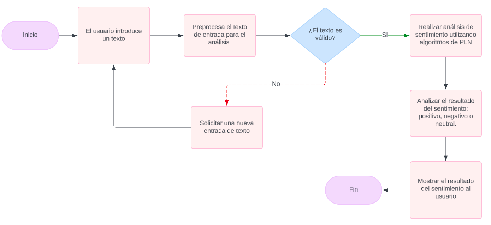
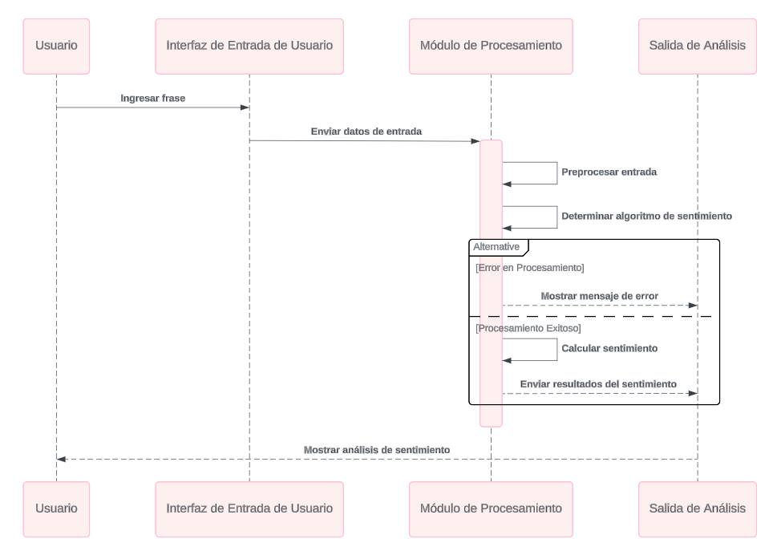

# Sentiment Analysis Web App POC - Challenge

## Descripción General

Descripción breve de la aplicación web de análisis de sentimiento utilizando NLP. Se detalla el uso de backend en Python, frontend en ReactJS y el despliegue en AWS o Azure.

- Enlace a la aplicación web: Pendiente
- Enlace al repositorio: Pendiente
- Enlace a la documentación: Pendiente
- Enlace al projecto en Jira: [Jira](https://sentiment-analysis-web-app.atlassian.net/jira/software/projects/SW/boards/1)

## Tabla de Contenidos
- [Descripción General](#descripción-general)
- [Stakeholders, Roles y Responsabilidades](#stakeholders-roles-y-responsabilidades)
- [Diagrama de procesos](#diagrama-de-procesos)
- [Diagrama de secuencia](#diagrama-de-secuencia)
- [Arquitectura](#arquitectura-básica-del-sistema)
- [Stack tecnológico](#stack-tecnológico)
- [Despliegue](#despliegue)

## Stakeholders, Roles y Responsabilidades

- **Manager de Proyecto**: Responsable de la planificación y coordinación del proyecto.
- **Desarrollador Frontend**: Encargado de la interfaz de usuario y la comunicación con el backend.
- **Desarrollador Backend**: Responsable de la lógica de negocio y la comunicación con el modelo NLP.
- **Equipo de Calidad**: Realiza pruebas y asegura la calidad del software.
- **Usuario Final**: Interactúa con la aplicación web para realizar el análisis de sentimiento.

## Diagrama de procesos

El diagrama siguiente muestra el flujo de procesos de la aplicación web de análisis de sentimiento. Incluye los siguientes pasos:

1. **Usuario**: Interactúa con la interfaz de usuario en el frontend.
2. **Frontend (ReactJS)**: Envía las solicitudes al backend.
3. **Backend (Python con Flask/FastAPI)**: Procesa las solicitudes y se comunica con el modelo NLP.
4. **Modelo NLP**: Realiza el análisis de sentimiento y devuelve los resultados al backend.
5. **Backend**: Envía los resultados al frontend.
6. **Frontend**: Muestra los resultados al usuario.

El despliegue se realiza en servicios de AWS o Azure, asegurando la escalabilidad y disponibilidad de la aplicación.

## Diagrama de secuencia

El diagrama de secuencia muestra la interacción entre los componentes de la aplicación web de análisis de sentimiento. Incluye los siguientes pasos:
1. **Usuario**: Ingresa el texto a analizar en la interfaz de usuario.
2. **Frontend (ReactJS)**: Envía la solicitud al backend.
3. **Backend (Python con Flask/FastAPI)**: Recibe la solicitud y envía el texto al modelo NLP.
4. **Modelo NLP**: Realiza el análisis de sentimiento y devuelve el resultado al backend.
5. **Backend**: Recibe el resultado y lo envía al frontend.
6. **Frontend**: Muestra el resultado al usuario.
7. **Usuario**: Visualiza el resultado del análisis de sentimiento.
8. **Fin del proceso**.
9. **Error**: En caso de error, se muestra un mensaje al usuario.

## Arquitectura básica del sistema

Descripción de la arquitectura general de la solución.

- **Frontend**: ReactJS para el manejo de la interfaz del usuario.

  * Tecnología:
    * Se utilizará el framework ReactJS para construir una interfaz de usuario interactiva y dinámica.
    * Se utilizará un sistema de control de versiones como Git para el desarrollo colaborativo.
    * Se utilizará Docker para la creación de contenedores y la gestión de dependencias.

  * Funcionalidades:
    * Formulario para que el usuario ingrese el texto a analizar.
    * Visualización clara de los resultados del análisis de sentimiento (positivo, negativo, neutral), posiblemente con una escala visual o numérica.
    * [Opcional] Posible inclusión de funcionalidades adicionales como historial de análisis, exportación de resultados, etc.

- **Backend**: Python con Flask/FastAPI para gestionar las solicitudes del frontend.

  * Tecnología:
    * Se empleará el lenguaje de programación Python para desarrollar la lógica de la aplicación.
    * Se utilizará un framework web como Flask o FastAPI para manejar las solicitudes HTTP y la interacción con el modelo de PLN.
    * El entorno debe ser escalable y seguro, con manejo básico AUTH y CORS.
    * Se implementará un sistema de logs para el registro de eventos y errores.
    * Se realizarán pruebas unitarias y de integración para garantizar la calidad del código.
    * Se utilizará un sistema de control de versiones como Git para el desarrollo colaborativo.
    * Se utilizará Docker para la creación de contenedores y la gestión de dependencias.

  * Funcionalidades:
    * Recibir el texto ingresado por el usuario desde el frontend.
    * Preprocesar el texto (limpieza, tokenización, etc.) y validación básica del texto.
    * Llamar al modelo de PLN para realizar el análisis de sentimiento.
    * Almacenar los resultados en una base de datos o en caché para futuras consultas.
    * Formatear y devolver los resultados al frontend.

- **Modelo NLP**: Descripción del modelo preentrenado de análisis de sentimiento.
    * Se utilizará un modelo preentrenado de análisis de sentimiento, como BERT, RoBERTa, etc.
    * El modelo debe ser capaz de clasificar el texto en categorías de sentimiento (positivo, negativo, neutral).
    * Se utilizará una biblioteca de PLN como Hugging Face Transformers para cargar y utilizar el modelo.
    * Se implementará un sistema de caché para almacenar los resultados y mejorar la velocidad de respuesta.

- **Despliegue**: Explicación del uso de servicios de AWS o Azure (EC2, S3, App Service, etc.).

  * Se realizarán pruebas de integración para garantizar la compatibilidad con el backend y el frontend.
  * Se utilizará un sistema de monitoreo para supervisar el rendimiento y la disponibilidad de la aplicación.

## Stack Tecnológico
- Python 3.8+
- Node.js 14+
- ReactJS
- AWS CLI / Azure CLI
- Docker, Git, Gitflow

## Despliegue

Pasos para el despliegue de la aplicación web en AWS o Azure.

1. **Clonar el repositorio**:
   - Ejecutar 'git clone URL' para obtener una copia local del código fuente.
2. **Configurar el backend**:
   - Navegar al directorio del backend: 'cd backend'.
   - Crear un entorno virtual: 'python -m venv venv'.
   - Activar el entorno virtual: 'source venv/bin/activate' (Linux) o 'venv\Scripts\activate' (Windows).
   - Instalar las dependencias: 'pip install -r requirements.txt'.
   - Configurar las variables de entorno necesarias.
3. **Configurar el frontend**:
   - Navegar al directorio del frontend: 'cd frontend'.
   - Instalar las dependencias: 'npm install'.
   - Configurar las variables de entorno necesarias.
4. **Crear y subir las imágenes Docker**:
   - Crear una imagen Docker para el backend y el frontend utilizando los 'Dockerfile' correspondientes.
   - Subir las imágenes a un registro de contenedores (ECR para AWS o ACR para Azure).
5. **Desplegar la aplicación**:
   - Configurar los servicios de AWS (ECS, ECR, RDS) o Azure (App Service, ACR, SQL Database).
   - Desplegar las imágenes Docker en los servicios configurados.
6. **Acceder a la aplicación**:
   - Obtener la URL del servicio desplegado.
   - Acceder a la aplicación web a través del navegador.
7. **Finalizar el despliegue**:
   - Verificar que todos los servicios estén funcionando correctamente.
   - Realizar pruebas de funcionalidad y rendimiento.
