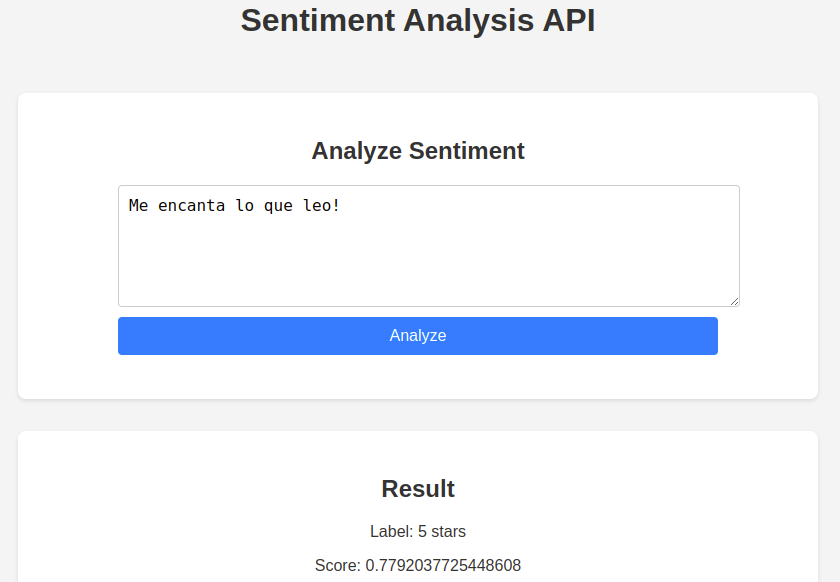

# Sentiment Analysis Web App POC - Challenge

## Descripción General

Descripción breve de la aplicación web de análisis de sentimiento utilizando NLP. Se detalla el uso de backend en Python, frontend en ReactJS y el despliegue en AWS o Azure.

- Enlace al repositorio: [Github](https://github.com/alicialara/SentimentAnalysisChallenge)
- Enlace al projecto en Jira: [Jira](https://sentiment-analysis-web-app.atlassian.net/jira/software/projects/SW/boards/1)

## Tabla de Contenidos
- [Descripción General](#descripción-general)
- [Stakeholders, Roles y Responsabilidades](#stakeholders-roles-y-responsabilidades)
- [Diagrama de procesos](#diagrama-de-procesos)
- [Diagrama de secuencia](#diagrama-de-secuencia)
- [Arquitectura](#arquitectura-básica-del-sistema)
- [Stack tecnológico](#stack-tecnológico)
- [Despliegue](#despliegue)

## Stakeholders, Roles y Responsabilidades

- **Manager de Proyecto**: Responsable de la planificación y coordinación del proyecto.
- **Desarrollador Frontend**: Encargado de la interfaz de usuario y la comunicación con el backend.
- **Desarrollador Backend**: Responsable de la lógica de negocio y la comunicación con el modelo NLP.
- **Equipo de Calidad**: Realiza pruebas y asegura la calidad del software.
- **Usuario Final**: Interactúa con la aplicación web para realizar el análisis de sentimiento.

## Diagrama de procesos

El diagrama siguiente muestra el flujo de procesos de la aplicación web de análisis de sentimiento. Incluye los siguientes pasos:

1. **Usuario**: Interactúa con la interfaz de usuario en el frontend.
2. **Frontend (ReactJS)**: Envía las solicitudes al backend.
3. **Backend (Python con Flask/FastAPI)**: Procesa las solicitudes y se comunica con el modelo NLP.
4. **Modelo NLP**: Realiza el análisis de sentimiento y devuelve los resultados al backend.
5. **Backend**: Envía los resultados al frontend.
6. **Frontend**: Muestra los resultados al usuario.

El despliegue se realiza en servicios de AWS o Azure, asegurando la escalabilidad y disponibilidad de la aplicación.

## Diagrama de secuencia

El diagrama de secuencia muestra la interacción entre los componentes de la aplicación web de análisis de sentimiento. Incluye los siguientes pasos:
1. **Usuario**: Ingresa el texto a analizar en la interfaz de usuario.
2. **Frontend (ReactJS)**: Envía la solicitud al backend.
3. **Backend (Python con Flask/FastAPI)**: Recibe la solicitud y envía el texto al modelo NLP.
4. **Modelo NLP**: Realiza el análisis de sentimiento y devuelve el resultado al backend.
5. **Backend**: Recibe el resultado y lo envía al frontend.
6. **Frontend**: Muestra el resultado al usuario.
7. **Usuario**: Visualiza el resultado del análisis de sentimiento.
8. **Fin del proceso**.
9. **Error**: En caso de error, se muestra un mensaje al usuario.

## Arquitectura básica del sistema

Descripción de la arquitectura general de la solución.

- **Frontend**: ReactJS para el manejo de la interfaz del usuario.

  * Tecnología:
    * Se utilizará el framework ReactJS para construir una interfaz de usuario interactiva y dinámica.
    * Se utilizará un sistema de control de versiones como Git para el desarrollo colaborativo.
    * Se utilizará Docker para la creación de contenedores y la gestión de dependencias.

  * Funcionalidades:
    * Formulario para que el usuario ingrese el texto a analizar.
    * Visualización clara de los resultados del análisis de sentimiento (positivo, negativo, neutral), posiblemente con una escala visual o numérica.
    * [Opcional] Posible inclusión de funcionalidades adicionales como historial de análisis, exportación de resultados, etc.

- **Backend**: Python con Flask/FastAPI para gestionar las solicitudes del frontend.

  * Tecnología:
    * Se empleará el lenguaje de programación Python para desarrollar la lógica de la aplicación.
    * Se utilizará un framework web como Flask o FastAPI para manejar las solicitudes HTTP y la interacción con el modelo de PLN.
    * El entorno debe ser escalable y seguro, con manejo básico AUTH y CORS.
    * Se implementará un sistema de logs para el registro de eventos y errores.
    * Se realizarán pruebas unitarias y de integración para garantizar la calidad del código.
    * Se utilizará un sistema de control de versiones como Git para el desarrollo colaborativo.
    * Se utilizará Docker para la creación de contenedores y la gestión de dependencias.

  * Funcionalidades:
    * Recibir el texto ingresado por el usuario desde el frontend.
    * Preprocesar el texto (limpieza, tokenización, etc.) y validación básica del texto.
    * Llamar al modelo de PLN para realizar el análisis de sentimiento.
    * Almacenar los resultados en una base de datos o en caché para futuras consultas.
    * Formatear y devolver los resultados al frontend.

- **Modelo NLP**: Descripción del modelo preentrenado de análisis de sentimiento.
    * Se utilizará un modelo preentrenado de análisis de sentimiento, como BERT, RoBERTa, etc.
    * El modelo debe ser capaz de clasificar el texto en categorías de sentimiento (positivo, negativo, neutral).
    * Se utilizará una biblioteca de PLN como Hugging Face Transformers para cargar y utilizar el modelo.
    * Se implementará un sistema de caché para almacenar los resultados y mejorar la velocidad de respuesta.

- **Despliegue**: Explicación del uso de servicios de AWS o Azure (EC2, S3, App Service, etc.).

  * Se realizarán pruebas de integración para garantizar la compatibilidad con el backend y el frontend.
  * Se utilizará un sistema de monitoreo para supervisar el rendimiento y la disponibilidad de la aplicación.

## Stack Tecnológico
- Python 3.8+
- Node.js 14+
- ReactJS
- AWS CLI / Azure CLI
- Docker, Git, Gitflow

--> Uso de Gitflow
--> Documentación de código: Sphinx

## Despliegue

Pasos para el despliegue de la aplicación web en AWS:

1. Docker build, tag, push a ECR

docker build -t "" . (back y front)

docker tag sentiment-analysis-frontend [id_proyecto].dkr.ecr.us-east-1.amazonaws.com/sentimentanalysispoc:latest
docker tag sentiment-analysis-api [id_proyecto].dkr.ecr.us-east-1.amazonaws.com/sentimentbackend:latest

aws ecr get-login-password --region us-east-1 | docker login --username AWS --password-stdin [id_proyecto].dkr.ecr.us-east-1.amazonaws.com

docker push [id_proyecto].dkr.ecr.us-east-1.amazonaws.com/sentimentanalysispoc:latest
docker push [id_proyecto].dkr.ecr.us-east-1.amazonaws.com/sentimentbackend:latest

Y nos devuelven las imágenes:

[id_proyecto].dkr.ecr.us-east-1.amazonaws.com/sentimentanalysispoc
[id_proyecto].dkr.ecr.us-east-1.amazonaws.com/sentimentbackend

2. Crear un clúster de ECS - Fargate (Serverless)

- Crear familia de permisos para asignar los contenedores
- Crear servicio en cluster ECS para desplegar back y front
- CloudFormation (similar a cloud build)
- CloudWatch (similar a cloud logging)

ECR - Container registry
ECS - Container service (Cloud Run / Compute engine)
	Fargate -> Cloud Run
	Family registry -> ECS > ECR

3. Crear un balanceador de carga
4. Crear un dominio en Route 53
5. Crear un certificado SSL en ACM
6. Asignar el certificado al dominio
7. Crear un grupo de seguridad para el balanceador de carga
8. Crear un grupo de seguridad para los contenedores
